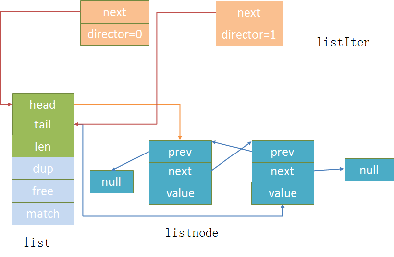

# adlist 链表

链表是 redis 列表的底层实现之。，当一个列表键包含的原始较多时，又或者键元素都是比较长的字符串时，redis 就会
使用链表作为底层实现。

---

## 6.X 版本的 redis

### listNode

```
// 链表的结点
typedef struct listNode {
    // 前置结点
    struct listNode *prev;
    // 后结点
    struct listNode *next;
    // 具体保存的值
    void *value;
} listNode;

```
listNode 是链表中的结点，void* 表示可以存储任意类型的值


### listIter

```

typedef struct listIter {
    listNode *next;
    int direction;
} listIter;

/* Directions for iterators */
#define AL_START_HEAD 0
#define AL_START_TAIL 1

```
listIter 是链表的迭代器
* next 只的当前遍历的结点
* direction 是方向，可以看出redis的链表是带表头指针和表尾指针的，所以可以从前或者后去遍历
* AL_START_HEAD、AL_START_TAIL 两个常量从名字就可以看出是 direction 的值

### list

```
//链表结构体
typedef struct list {
    // 头结点
    listNode *head;
    // 尾部结点
    listNode *tail;
    //节点复制函数
    void *(*dup)(void *ptr);
    //节点释放函数
    void (*free)(void *ptr);
    //节点比较函数
    int (*match)(void *ptr, void *key);
    unsigned long len;
} list;


```

list 是链表的结构体了
  * 可以看出 redis 的链表是一个双端无还的链表
  * 3个结点复制函数相当于多态，可以设置不同类型的函数
  * len 很明显就是指链表的长度了


  
---

## 主要函数

链表的实现这里就不说了，这里主要看下迭代器的实现吧

### 获取链表迭代器指针

```
/* Returns a list iterator 'iter'. After the initialization every
 * call to listNext() will return the next element of the list.
 *
 * This function can't fail. */
listIter *listGetIterator(list *list, int direction)
{
    listIter *iter;
    // 分配迭代器内存
    if ((iter = zmalloc(sizeof(*iter))) == NULL) return NULL;
    if (direction == AL_START_HEAD)
        iter->next = list->head;
    else
        iter->next = list->tail;
    iter->direction = direction;
    return iter;
}
```


### 释放迭代器
```
//释放迭代器对象
void listReleaseIterator(listIter *iter) {
    zfree(iter);
}
```

### 设置迭代器
```
//设置迭代器, 指定链表从head开始遍历
void listRewind(list *list, listIter *li) {
    li->next = list->head;
    li->direction = AL_START_HEAD;
}

//设置迭代器, 指定链表从 tail 开始遍历
void listRewindTail(list *list, listIter *li) {
    li->next = list->tail;
    li->direction = AL_START_TAIL;
}
```

### 获取迭代器下一个节点

```
listNode *listNext(listIter *iter)
{
listNode *current = iter->next;

    if (current != NULL) {
        if (iter->direction == AL_START_HEAD)
            iter->next = current->next;
        else
            iter->next = current->prev;
    }
    return current;
}
```
---

## 参考：

* `https://www.jianshu.com/p/5b44103846de`
* `https://www.jianshu.com/p/8c0fdeffdfcb`
* `https://zhuanlan.zhihu.com/p/469934624`
* `https://hardcore.feishu.cn/docs/doccnp9v7IljXiJ5FpNT1ipLhlR#`
* `redis设计与实现`


