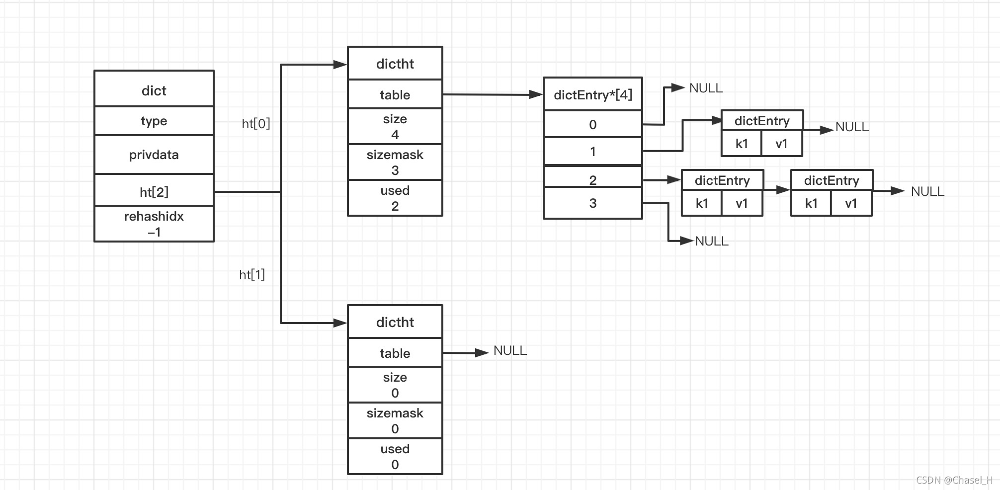
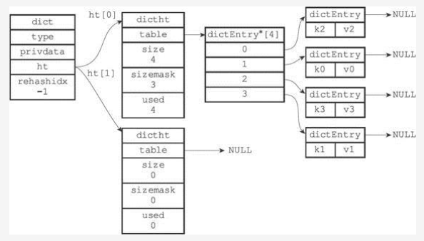
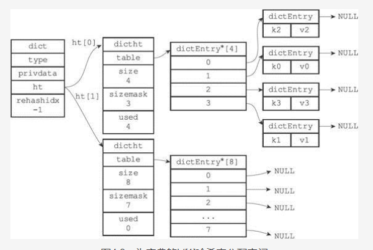
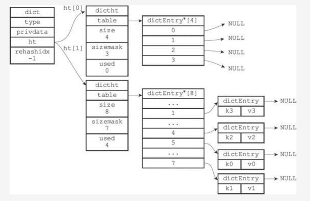
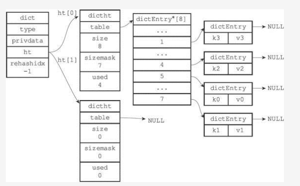

# dict 字典

字典大家都很熟悉了，有的地方叫它关联数组、map等，其实就是一个键值对。

redis 中是使用哈希表作为字典的底层实现的

---

## 6.X 版本的 redis


### dictEntry

```
typedef struct dictEntry {
    // key
    void *key;
    // 值
    union {
        void *val;
        uint64_t u64;
        int64_t s64;
        double d;
    } v;
    struct dictEntry *next;     /* Next entry in the same hash bucket. */
    void *metadata[];           /* An arbitrary number of bytes (starting at a
                                 * pointer-aligned address) of size as returned
                                 * by dictType's dictEntryMetadataBytes(). */
} dictEntry;
```

* dictEntry 是一个单独的哈希表结点
* 可以看出值得类型可以是一个引用、uint64、int64、double
* dictEntry 使用链地址法来解决哈希冲突

### dictht

```
typedef struct dictht {
    // 哈希表数组
    dictEntry **table;
    // 哈希表的大小
    unsigned long size;
    // 掩码
    unsigned long sizemask;
    // 已有的结点数量
    unsigned long used;
} dictht;
```

* dictht 是哈希表结构
* sizemask 是用来计算哈希索引值得，总是等于 size - 1


### dictType

```
// 相关的操作函数，以函数指针的方式存在
typedef struct dictType {
    // 计算哈希值的函数
    uint64_t (*hashFunction)(const void *key);
    void *(*keyDup)(void *privdata, const void *key);
    void *(*valDup)(void *privdata, const void *obj);
    int (*keyCompare)(void *privdata, const void *key1, const void *key2);
    void (*keyDestructor)(void *privdata, void *key);
    void (*valDestructor)(void *privdata, void *obj);
    int (*expandAllowed)(size_t moreMem, double usedRatio);
} dictType;
```
这些都是


### dict

```
// 字典
typedef struct dict {
    // 字典类型，相当于多态，可以给与不同的函数
    dictType *type;
    // 私有数据
    void *privdata;
    // 包含2个哈希表的数组
    dictht ht[2];
    // rehash 索引
    long rehashidx; /* rehashing not in progress if rehashidx == -1 */
    // rehash 状态
    int16_t pauserehash; /* If >0 rehashing is paused (<0 indicates coding error) */
} dict;

```

* dict 就是一个字典结构了
* type 是其类型，提供了一些列操作字典的函数，redis会为不同的字典提供不同的函数实现了多态
* privdata 就是提供给这些函数的参数
* ht 包含了两个数组，一般情况下，只会使用ht[0], ht[1] 会在进行 rehash 的时候使用
* rehashidx 当 rehash 不在进行时，值为 -1



---

## 哈希算法

要将一个键值对添加到字典里面时，需要先根据键计算出哈希值和索引值，然后根据索引值把结点放到对应的哈希表数组
对应的索引上


1. 使用字典设置的哈希函数，计算键 key 的哈希值
   1. hash = dict->type->hashFunction(key)
2. 使用哈希表的sizemask属性和第一步得到的哈希值进行于运算，计算索引值
   1. index = hash & dict->ht[x].sizemask;
   2. x 根据实际情况不同可以是0或者1


### 哈希冲突

当2个以上的键被分配到同一个索引上时，我们称为哈希冲突

redis 使用的是链地址法来解决哈希冲突，每个哈希结点（dictEntry）都有个 next 字段用来指向下一个结点，这样
多个哈希表结点通过 next 构成了一个链表，这样就解决了哈希冲突的问题

    主要redis采用的是头插法，即后面来的结点在链表中排到前面

### rehash

随着操作的不断进行，哈希表的结点会不断的增多或者减少,为了保证资源利用的效率，redis 会通 rehash 来进行相应
的扩容或者收缩

* 为 ht[1] 分配空间，空间大小取决于当前需要进行的操作和目前 ht[0] 包含结点的数量来决定
  * 如果是扩容操作，那么 ht[1] 为第一个大于等于 ht[0].used*2 的 2^n 的数
  * 如果是收缩操作，那么 ht[1] 为第一个大于等于 ht[0].used 的 2^n 的数
* 将 ht[0] 中所有的键值都 rehash 到 ht[1] 中
  * rehash 只的是重新计算哈希索引
* 当全部迁移完成后，释放 ht[0], 将 ht[1] 改为 ht[0] 并且新建一个空的哈希表 ht[1]


#### 举个例子，假设目前字典结构如下：



##### 1. 计算ht[1]的大小

ht[0].used*2 = 4*2 = 8 = 2^3 所以 ht[1] 的大小为8




##### 2. 迁移 ht[0] 到 ht[1]




注意 ht[1] 中每个节点的位置都是重新计算得到的


##### 3. 释放 ht[0], 将 ht[1] 改为 ht[0] 并且新建一个空的哈希表 ht[1]




#### 什么时候会发生 rehash

rehash 扩容分为两种：

* 自然 rehash：负载因子大于等于1 时且 dict_can_resize 为 1
  * 服务器目前没有执行BGSAVE命令或者BGREWRITEAOF命令,也就是没有进行持久化的时候
  * dict_can_resize 是 redis 定义的一个全局变量，用来判断是否可以进行 rehash
* 强制 rehash：负载因子大于等于 > dict_force_resize_ratio(5)
  * 务器目前正在执行BGSAVE命令或者BGREWRITEAOF命令
* * 而当负载因子小于0.1时，程序自动开始对哈希表执行收缩操作
* 哈希表负载因子公式：load_factor = ht[0].used / ht[0].size


#### 渐进式的 rehash

思考2个问题：
* redis 是如何监控负载因子的大小的用于触发 rehash 的 ？
* 如果我的字典包含数亿个结点，每次 rehash 不是会暂用大量时间，导致服务长时间不可用？

基于这两个问题，redis 并不是一次将所有结点全部迁移，而是分多次，渐进式的将 ht[0] 中的结点迁移到 ht[1] 中
的

* 为 ht[1] 分配空间 这个时候字典同时持有 ht[0] 和 ht[1]
* 将 dict.rehashidx 设置为0（表明当前正在rehash），并且通过它来维持一个计数器
* 在 rehash 期间，每对字段的增删改查时都会进行该结点的 rehash 将 ht[0] 的值迁移到 ht[1]。
并且 rehashidx ++
* 随着不断的进行 ht[0] 的所有结点都会迁移到 ht[1] 这时 rehashidx 设置为 -1 表明 rehash 已经完成


    渐进式的 rehash 的好处是将 rehash 大量的计算平摊到每次的****增删改查****


在 rehash 过程中 redis 会同时持有 ht[0] 和 ht[1] 这个时候的 删改查 操作会在两个表中进行，比如先查找
ht[0] 没有就查找 ht[1]

新增很明显就在ht[1] 上新增就可以了

    渐进式 rehash 也有一个问题，如果一个正在进行中的 rehash 但是其服务器长期处于空闲状态，导致哈希表长期
    使用0和1号两个表。为解决这个问题，在serverCron定时函数中，每次拿出1ms时间来执行Rehash操作，
    每次步长为100。所以实质上 redis 的 rehash 是渐进式的 rehash + 定时 rehash

---

## 部分源码解析

```
// 判断当前是否在 rehash
#define dictIsRehashing(d) ((d)->rehashidx != -1)
// 暂停 rehash
#define dictPauseRehashing(d) (d)->pauserehash++
// 恢复 rehash
#define dictResumeRehashing(d) (d)->pauserehash--
```

`static int dict_can_resize = 1;`

dict_can_resize 是 redis 定义的一个全局变量，用来判断是否可以进行 rehash

### 扩展哈希表
```
/* Expand the hash table if needed */
static int _dictExpandIfNeeded(dict *d)
{
    /* 已经在进行 rehash 了 */
    if (dictIsRehashing(d)) return DICT_OK;

    /* 如果哈希表为空，将其扩展为初始大小  */
    if (d->ht[0].size == 0) return dictExpand(d, DICT_HT_INITIAL_SIZE);

    // 核心就是这部分
    // d->ht[0].used >= d->ht[0].size 其实就是负载因子大于1
    // dict_can_resize 默认为1 在 持久化的时候，会改为0
    // d->ht[0].used/d->ht[0].size 为负载因子
    // dict_force_resize_ratio 为全局变量，默认为 5
    // dictTypeExpandAllowed 用来检查是否可以分配内存的
    if (d->ht[0].used >= d->ht[0].size &&
        (dict_can_resize ||
         d->ht[0].used/d->ht[0].size > dict_force_resize_ratio) &&
        dictTypeExpandAllowed(d))
    {
        return dictExpand(d, d->ht[0].used + 1);
    }
    return DICT_OK;
}
```


### 扩展或者创建哈希表
```

int _dictExpand(dict *d, unsigned long size, int* malloc_failed)
{
    if (malloc_failed) *malloc_failed = 0;

    /* 如果已经在 rehash了，或者不需要扩容 */
    if (dictIsRehashing(d) || d->ht[0].used > size)
        return DICT_ERR;
    
    // 创建一个新的哈希表
    dictht n; /* the new hash table */
    // 新表的大小
    unsigned long realsize = _dictNextPower(size);

    /* Detect overflows */
    if (realsize < size || realsize * sizeof(dictEntry*) < realsize)
        return DICT_ERR;

    /* rehash 同样大小是没用的. */
    if (realsize == d->ht[0].size) return DICT_ERR;

    /* 分配空间 */
    n.size = realsize;
    n.sizemask = realsize-1;
    if (malloc_failed) {
        n.table = ztrycalloc(realsize*sizeof(dictEntry*));
        *malloc_failed = n.table == NULL;
        if (*malloc_failed)
            return DICT_ERR;
    } else
        n.table = zcalloc(realsize*sizeof(dictEntry*));

    n.used = 0;

    /* 用于判断是否是第一次初始化，是的化创建 d->ht[0] 就可以了 */
    if (d->ht[0].table == NULL) {
        d->ht[0] = n;
        return DICT_OK;
    }

    /* Prepare a second hash table for incremental rehashing */
    d->ht[1] = n;
    // rehashidx = 0 表明开始了 rehash
    d->rehashidx = 0;
    return DICT_OK;
}

```

### 计算扩展后的哈希表大小

```
/* 哈希表的下一次大小 */
static unsigned long _dictNextPower(unsigned long size)
{
    // 这个值为 4 
    unsigned long i = DICT_HT_INITIAL_SIZE;
    // size 超过了 long 的最大值
    if (size >= LONG_MAX) return LONG_MAX + 1LU;
    // 这部分就是核心了
    // 最小返回 4 否则就是 返回第一个大于 2^2 的值
    while(1) {
        if (i >= size)
            return i;
        i *= 2;
    }
}

```


