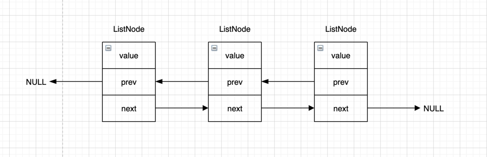
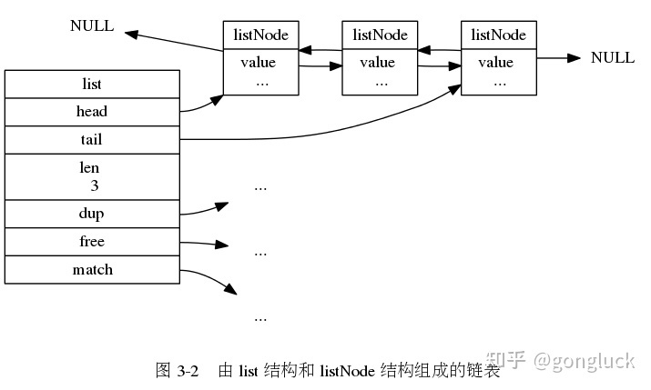

# SDS

sds 是 redis 中字符串的底层实现，它是基于 c 字符串实现的， 本质上就是自己定义的一个结构体.

如果你需要的是一个可以被修改的字符串，而不是一个字符串的字面量（比如打印日志时的消息），这个时候 redis 会使用 sds 作为字符串的表示

---

## 3.X 版本的 redis
redis6.x 的 sds 的数据结构定义与 redis3.0.0 相差比较大，但是核心思想不变。先从简单的了解下 3.X的版本

```
struct sdshdr {
    //记录buf数组中已使用字节的数量
    //等于SDS所保存字符串的长度
    unsigned int len;

    //记录buf数组中未使用字节的数量
    unsigned int free;

    //char数组，用于保存字符串
    char buf[];
};
如下图字符串 Aobing 在 redis 中的存储形式：

```



* len 表示已经使用的长度为6字节；
* free 表示未使用的长度为0字节；
* buf 是一个char的数组，用于保存字符串，注意最后一个字符串是一个空字符，这是遵循了 c 字符串以空字符结尾的惯例，并且这个 1字节是不计算在
len 中的，这样做的好处是可以使用部分 c的函数（比如 print()、strlen() 等函数），不用自己去实现；
  
---

## 6.X 版本的 redis
  
3.x 的版本看起来不错，但是有个问题，不同长度的字符串它的头部占用的空间是相同的，即都是 int，所以再新版本中拆分出 5种类型的 sds

```
typedef char *sds;

/* 注意：sdshdr5从未被使用，Redis中只是访问flags */
struct __attribute__ ((__packed__)) sdshdr5 {
    unsigned char flags; /* 低3位存储类型, 高5位存储长度 */
    char buf[];
};
struct __attribute__ ((__packed__)) sdshdr8 {
    uint8_t len; /* 已使用 */
    uint8_t alloc; /* 总长度，用1字节存储 */
    unsigned char flags; /* 低3位存储类型, 高5位存储长度 */
    char buf[];
};
struct __attribute__ ((__packed__)) sdshdr16 {
    uint16_t len; /* 已使用 */
    uint16_t alloc; /* 总长度，用2字节存储 */
    unsigned char flags; /* 低3位存储类型, 高5位存储长度 */
    char buf[];
};
struct __attribute__ ((__packed__)) sdshdr32 {
    uint32_t len; /* used */
    uint32_t alloc; /* 总长度，用4字节存储 */
    unsigned char flags; /* 低3位存储类型, 高5位存储长度 */
    char buf[];
};
struct __attribute__ ((__packed__)) sdshdr64 {
    uint64_t len; /* used */
    uint64_t alloc; /* 总长度，用8字节存储 */
    unsigned char flags; /* 低3位存储类型, 高5位存储长度 */
    char buf[];
};

```

很明显，redis 会根据所要存储字符串的长度选择合适的 sds 类型，比如如果字符串 abc 同时用 `sdshdr8` 和 `sdshdr16` 存储的话，
仅仅是 len 和 alloc 两个字段，`sdshdr8` 就比` sdshdr16` 节省了两个字节

---

### flags 是什么？

flags 字段就是用来区分5种类型的标识，可以发现这个标识长度是一字节，其中低3位存储类型, 高5位存储长度(在`sdshdr5` 中)，所以其实 flags 
总过可以表示 2^3 = 8 种类型，2^5=32 字节的长度



声明的5中类型，所以上图中使用的是 `sdshdr8`
```
#define SDS_TYPE_5  0
#define SDS_TYPE_8  1
#define SDS_TYPE_16 2
#define SDS_TYPE_32 3
#define SDS_TYPE_64 4
```

    按照注释 `sdshdr5` 是没有实际使用过的，但其实 redis Key 小于 32 个字节的时候是会使用 `sdshdr5` 的，其中 低3位存储类型, 高5位存储长度
    所以你会发现 `sdshdr5` 是没有 len 的。而 value 最低也是会用 `sdshdr8` 这是因为 key 创建后长度是不会发生变化的，但是 value 会经常变
    动，可能很快就发生扩容了。

---

### __attribute__ ((__packed__)) 有什么用？

结构体中有个 `__attribute__ ((__packed__))` 可能还不明白它的意思，它是用来取消 <b>对齐填充</b> 的

什么是对齐填充？

考虑如下结构：

```
typedef struct{
     char  c1;
     short s; 
     char  c2; 
     int   i;
} s;
```

假设c1的起始地址为0，那么s的地址为1，c2的地址为3，i的地址为4吗？

现代计算机中，内存空间按照字节划分，理论上可以从任何起始地址访问任意类型的变量

但实际中在访问特定类型变量时经常在特定的内存地址访问，这就需要各种类型数据按照一定的规则在空间上排列，而不是顺序一个接一个地存放，这就是对齐。
这一般是由于各种硬件平台的原因

所以因为对齐的原因，上述结构体中各个字段的地址并不是连续的，那么如果我们要取消对其要怎么做？

使用：__attribute__ ((packed))：取消结构在编译过程中的优化对齐，按照实际占用字节数进行对齐 就可以了

一个新的问题来了？ 为什么 redis 需要取消对齐？

根据 `typedef char *sds;` 这行代码可以看出， sds 其实是一个 char 的引用，如下图：


    从图中我们可以看出，SDS 的指针并不是指向 SDS结构体 的起始位置（len位置），而是直接指向 buf[]，使得 SDS 可以直接使用 
    C 语言 string.h 库中的某些函数，做到了兼容。

这样如果需要访问 flags 只需要后退一步即可 `lagsPointer = ((unsigned char*)s)-1`, 所以如果没有填充对齐，我们是无法找到 flags 的

---

## 使用 SDS 有什么好处？

1. 常数级别的获取字符串长度


2. 二进制安全

C字符串中的字符除了末尾字符为'\0'外其他字符不能为空字符，否则会被认为是字符串结尾(即使实际上不是)。

这限制了C字符串只能保存文本数据，而不能保存二进制数据。而SDS使用len属性的值判断字符串是否结束，所以不会受'\0'的影响。

3. 杜绝缓冲区溢出

字符串的拼接操作是使用十分频繁的，由于C字符串不记录自身的长度，所以再拼接时必须分配了足够多的内存，而一旦这个条件不成立就会产生缓冲区溢出，
会把其他数据覆盖掉


与C字符串不同，SDS 的自动扩容机制完全杜绝了发生缓冲区溢出的可能性。

---

### 自动扩容原理

````
/* s: 源字符串
 * addlen: 新增长度
 */
sds sdsMakeRoomFor(sds s, size_t addlen) {
    void *sh, *newsh;
    // sdsavail: s->alloc - s->len, 获取 SDS 的剩余长度
    size_t avail = sdsavail(s);
    size_t len, newlen, reqlen;
    // 根据 flags 获取 SDS 的类型 oldtype
    char type, oldtype = s[-1] & SDS_TYPE_MASK;
    int hdrlen;
    size_t usable;

    /* Return ASAP if there is enough space left. */
    // 剩余空间大于等于新增空间，无需扩容，直接返回源字符串
    if (avail >= addlen) return s;
    // 获取当前长度
    len = sdslen(s);
    // 
    sh = (char*)s-sdsHdrSize(oldtype);
    // 新长度
    reqlen = newlen = (len+addlen);
    // 断言新长度比原长度长，否则终止执行
    assert(newlen > len);   /* 防止数据溢出 */
    // SDS_MAX_PREALLOC = 1024*1024, 即1MB
    if (newlen < SDS_MAX_PREALLOC)
        // 新增后长度小于 1MB ，则按新长度的两倍扩容
        newlen *= 2;
    else
        // 新增后长度大于 1MB ，则按新长度加上 1MB 扩容
        newlen += SDS_MAX_PREALLOC;
    // 重新计算 SDS 的类型
    type = sdsReqType(newlen);

    /* Don't use type 5: the user is appending to the string and type 5 is
     * not able to remember empty space, so sdsMakeRoomFor() must be called
     * at every appending operation. */
    // 不使用 sdshdr5 
    if (type == SDS_TYPE_5) type = SDS_TYPE_8;
    // 获取新的 header 大小
    hdrlen = sdsHdrSize(type);
    assert(hdrlen + newlen + 1 > reqlen);  /* Catch size_t overflow */
    if (oldtype==type) {
        // 类型没变
        // 调用 s_realloc_usable 重新分配可用内存，返回新 SDS 的头部指针
        // usable 会被设置为当前分配的大小
        newsh = s_realloc_usable(sh, hdrlen+newlen+1, &usable);
        if (newsh == NULL) return NULL; // 分配失败直接返回NULL
        // 获取指向 buf 的指针
        s = (char*)newsh+hdrlen;
    } else {
        // 类型变化导致 header 的大小也变化，需要向前移动字符串，不能使用 realloc
        newsh = s_malloc_usable(hdrlen+newlen+1, &usable);
        if (newsh == NULL) return NULL;
        // 将原字符串copy至新空间中
        memcpy((char*)newsh+hdrlen, s, len+1);
        // 释放原字符串内存
        s_free(sh);
        s = (char*)newsh+hdrlen;
        // 更新 SDS 类型
        s[-1] = type;
        // 设置长度
        sdssetlen(s, len);
    }
    // 获取 buf 总长度(待定)
    usable = usable-hdrlen-1;
    if (usable > sdsTypeMaxSize(type))
        // 若可用空间大于当前类型支持的最大长度则截断
        usable = sdsTypeMaxSize(type);
    // 设置 buf 总长度
    sdssetalloc(s, usable);
    return s;
}
````

扩容阶段：

* 若 SDS 中剩余空闲空间 avail 大于新增内容的长度 addlen，则无需扩容
* 若 SDS 中剩余空闲空间 avail 小于或等于新增内容的长度 addlen：
    * 若新增后总长度 len+addlen < 1MB，则按新长度的两倍扩容。
    * 若新增后总长度 len+addlen > 1MB，则按新长度加上 1MB 扩容。

内存分配阶段：

* 根据扩容后的长度选择对应的 SDS 类型
    * 若类型不变，则只需通过 s_realloc_usable扩大 buf 数组即可
    * 若类型变化，则需要为整个 SDS 重新分配内存，并将原来的 SDS 内容拷贝至新位置
    


## 创建 SDS

```
sds _sdsnewlen(const void *init, size_t initlen, int trymalloc) {
    void *sh;
    sds s;
    // 根据初始化长度判断 SDS 的类型
    char type = sdsReqType(initlen);
    // SDS_TYPE_5 强制转换为 SDS_TYPE_8
    // 创建一个空字符会强制 SDS_TYPE_5 -> SDS_TYPE_8
    if (type == SDS_TYPE_5 && initlen == 0) type = SDS_TYPE_8;
    // 获取头部大学
    int hdrlen = sdsHdrSize(type);
    // 指向 flags 的指针
    unsigned char *fp; /* flags pointer. */
    // 分配的空间
    size_t usable;
    // 防止溢出
    assert(initlen + hdrlen + 1 > initlen); /* Catch size_t overflow */
    // 分配空间
    // s_trymalloc_usable: 尝试分配内存，失败则返回NULL
    // s_malloc_usable: 分配内存或者抛异常[不友好]
    sh = trymalloc?
        s_trymalloc_usable(hdrlen+initlen+1, &usable) :
        s_malloc_usable(hdrlen+initlen+1, &usable);
    if (sh == NULL) return NULL;
    if (init==SDS_NOINIT)
        init = NULL;
    else if (!init)
        memset(sh, 0, hdrlen+initlen+1);
    // s 此时指向buf
    s = (char*)sh+hdrlen;
    // 指向flags
    fp = ((unsigned char*)s)-1;
    usable = usable-hdrlen-1;
    // 对不同类型的 SDS 可分配空间进行截断
    if (usable > sdsTypeMaxSize(type))
        usable = sdsTypeMaxSize(type);
    switch(type) {
        case SDS_TYPE_5: {
            *fp = type | (initlen << SDS_TYPE_BITS);
            break;
        }
        case SDS_TYPE_8: {
            SDS_HDR_VAR(8,s);
            sh->len = initlen;
            sh->alloc = usable;
            *fp = type;
            break;
        }
        // ... 省略
    }
    if (initlen && init)
        memcpy(s, init, initlen);
    // 末尾添加\0
    s[initlen] = '\0';
    return s;
}

```

通过sdsnewlen方法我们可以获得以下信息：

* 创建一个空字符SDS_TYPE_5 会被强制转换为 SDS_TYPE_8 类型；
* 创建时默认会在末尾加'\0'；
* 返回值是指向 SDS 结构中 buf 的指针；
* 返回值是char *sds类型，可以兼容部分C函数。

---

参考：

* `https://mp.weixin.qq.com/s/uYUQ1P8Dq1Cdknxif7lF-g`
* `https://www.modb.pro/db/412840`
* `https://www.jianshu.com/p/1994433e1ed8`
* `redis设计与实现`


    


  

